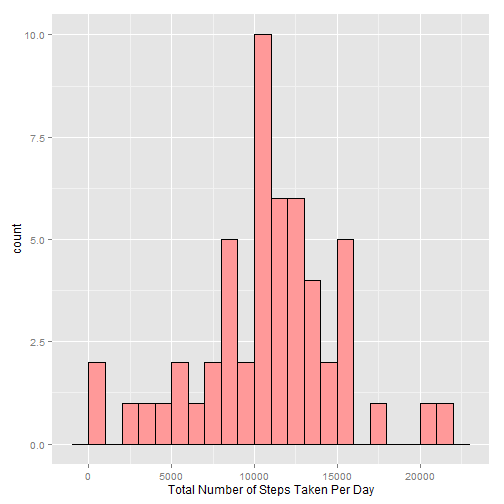
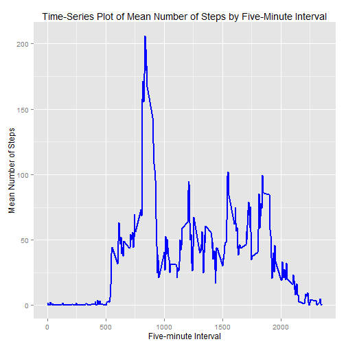
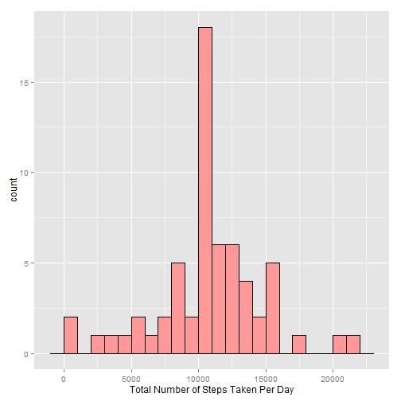
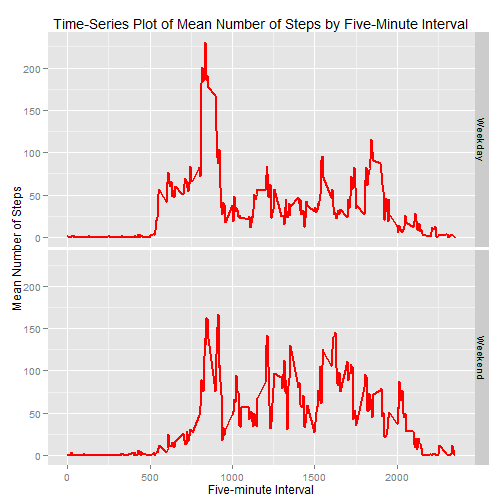

Reproducible Research: Peer Assessment 1
========================================

###ProfCLC

####Wednesday, November 12, 2014


##Global Settings and Package Requirements


```r
echo=TRUE #set echo to on so that others can read the code
options(scipen = 1) #this removes scientific notation from outputs
require(ggplot2)
```

##Loading and Preprocessing the Data


```r
unzip("repdata-data-activity.zip") #be sure to put the downloaded zipped file in your working directory
dat <- read.csv("activity.csv", colClasses = c("integer", "Date", "factor"))
datNA <- na.omit(dat) #this will omit the NAs for this part of the assignment
```

##What is the mean total number of steps taken per day?

-Note that for this part of the assignment, missing data can be ignored.  Hence, NA data were removed for this part of the analysis using the `na.omit()` command.

###Histogram of the total number of steps taken each day


```r
stepsDatNA <- tapply(datNA$steps, datNA$date, FUN=sum)
stepsDF <- as.data.frame(stepsDatNA)

g <- ggplot(stepsDF, aes(stepsDatNA))
p <- g + 
        geom_histogram(binwidth=1000, fill="#FF9999", color="black") +
        xlab(label = "Total Number of Steps Taken Per Day")
print(p)
```

 

###Calculation of mean and median


```r
stepMean <- round(mean(stepsDatNA), digits = 0); print(stepMean)
```

```
## [1] 10766
```

```r
stepMed <- round(median(stepsDatNA), digits = 0); print (stepMed)
```

```
## [1] 10765
```

The mean number of steps taken per day is **10766** and the median number of steps taken per day is **10765**. Given that the mean and median are relatively similar, and based on visual examination of the histogram, the data appear to be somewhat symmetrical, though there are extreme values in either tail.

##What is the average daily activity pattern?

###Time-Series Plot

```r
dailyMean <- with(data = datNA, aggregate(x = steps, by = list(interval = as.numeric(as.character(datNA$interval))), FUN = mean, na.rm = TRUE))
names(dailyMean) <- c("Interval", "Steps")
g <- ggplot(dailyMean, aes(Interval, Steps))
p <- g +
        geom_line(color = "blue", size = 1) +
        ggtitle(label = "Time-Series Plot of Mean Number of Steps by Five-Minute Interval") +
        xlab(label = "Five-minute Interval") +
        ylab(label = "Mean Number of Steps")
print(p)
```

 

###Interval with the maximum mean number of steps


```r
maxSteps <- dailyMean[which.max(dailyMean$Steps),]
print(maxSteps)
```

```
##     Interval    Steps
## 104      835 206.1698
```

```r
maxInt <- maxSteps[1]
maxSt <- round(maxSteps[2]*100, digits = 0)
```
The maximum number of steps, when examining the average across all days, was **20617**, which occurred at interval **835**.

##Imputing missing values

###Calculate the total number of missing values


```r
countNA <- sum(is.na(dat))
print(countNA)
```

```
## [1] 2304
```
The total number of missing values in the orginal data is **2304**.

###Replace missing values and create new data set with NAs replaced


```r
dat2 <- dat 
for (i in 1:nrow(dat2)) {
    if (is.na(dat2$steps[i])) {
        dat2$steps[i] <- dailyMean[which(dat2$interval[i] == dailyMean$Interval), ]$Steps
    }
}

countDat2NA <- sum(is.na(dat2))
```
The total number of missing values in the new data set, "dat2", is **0**; therefore, all NAs have successfully been replaced.

###Histogram of the total number of steps taken each day with NAs replaced


```r
stepsDat2 <- tapply(dat2$steps, dat2$date, FUN=sum)
stepsDF2 <- as.data.frame(stepsDat2)

g <- ggplot(stepsDF2, aes(stepsDat2))
p <- g + 
        geom_histogram(binwidth=1000, fill="#FF9999", color="black") +
        xlab(label = "Total Number of Steps Taken Per Day")
print(p)
```

 

The histrogram is still symmetrical, as evidenced by a reduction in the tails and a higher number of counts in the center of the distribution.

###Calculation of mean and median with NAs replaced


```r
stepMean2 <- round(mean(stepsDat2), digits = 0); print(stepMean2)
```

```
## [1] 10766
```

```r
stepMed2 <- round(median(stepsDat2), digits = 0); print (stepMed2)
```

```
## [1] 10766
```

```r
stepMeanDiff <- (stepMean2 - stepMean); print(stepMeanDiff)
```

```
## [1] 0
```

```r
stepMedDiff <- (stepMed2 - stepMed); print(stepMedDiff)
```

```
## [1] 1
```

The mean number of steps taken per day with NAs replaced is **10766** and the median number of steps taken per day with NAs replaced is **10766**. The difference in the mean of the data after replacing NAs was **0**, and the difference in the median of the data after replacing NAs was **1**. Given that data were replaced with a mean, and that the mean and median were nearly identical in the original data with NAs ommitted, these results are not surprising.  That is, when replacing data with a value of central tendency, the overall measure of central tendency for a distribution will be largely unaffected because replaced missing values will occur multiple times in the data set, which will not affect the measure (in this case the mean).  It is well known, however, that mean replacement (or other measures of central tendency) will generally result in lower variability.

##Are there differences in activity patterns between weekday and weekends?

### Create a new factor variable with two values: "weekday" or "weekend"


```r
dat2$days <- factor(format(dat$date, "%A"))
levels(dat2$days) <- list(Weekday = c("Monday", "Tuesday", "Wednesday","Thursday", "Friday"),
        Weekend = c("Saturday", "Sunday"))
```

###Time series panel plot of the "weekday" or "weekend" data.


```r
daysMean <- with(data = dat2, aggregate(x = steps, by = list(interval = as.numeric(as.character(dat2$interval)), days = dat2$days), FUN = mean))
names(daysMean) <- c("Interval", "Days", "Steps")


g <- ggplot(daysMean, aes(Interval, Steps))
p <- g +
        geom_line(color = "Red", size = 0.75) +
        facet_grid(Days ~ .) +
        ggtitle(label = "Time-Series Plot of Mean Number of Steps by Five-Minute Interval") +
        xlab(label = "Five-minute Interval") +
        ylab(label = "Mean Number of Steps")
print(p)
```

 

It appears that the distribution of steps is more uniform on the weekends than on the weekdays.  This supports the assertion that, in general, there is more activity on the weekends than during the weekdays when a reduced number of steps would be evidence of a sedantry work environment.
